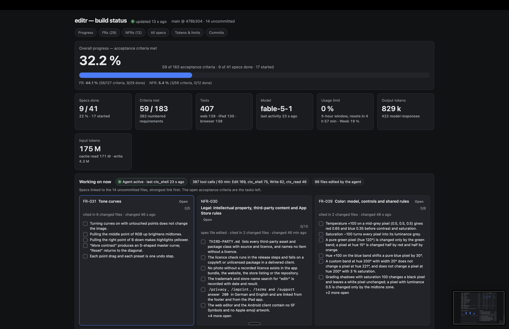
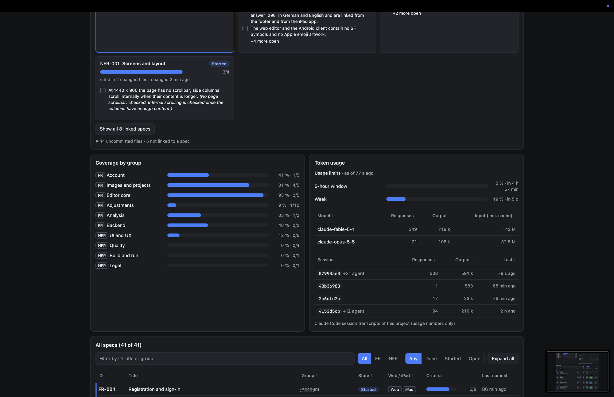
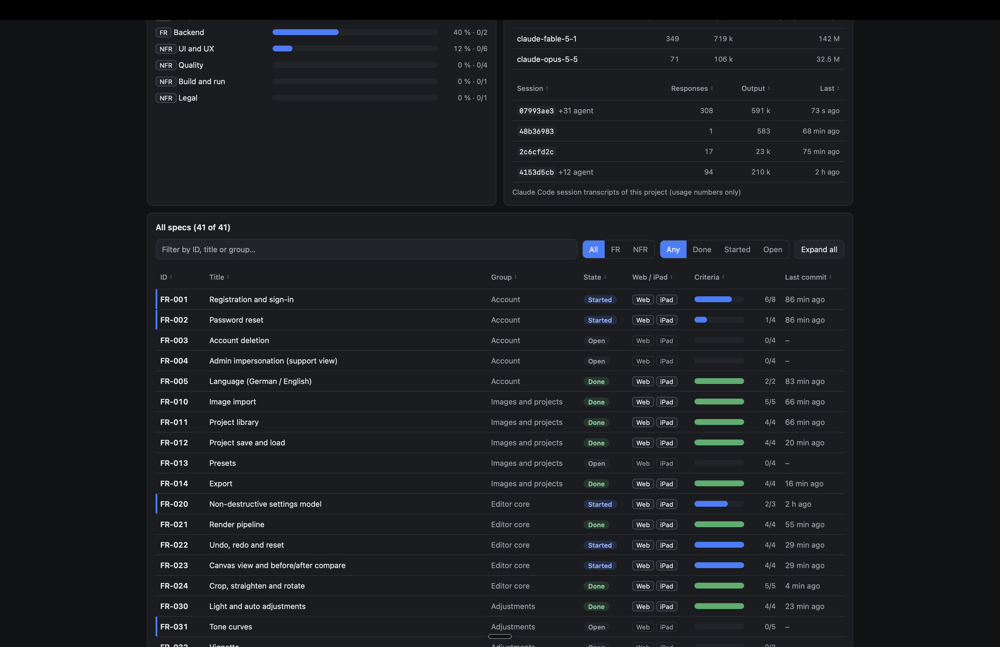
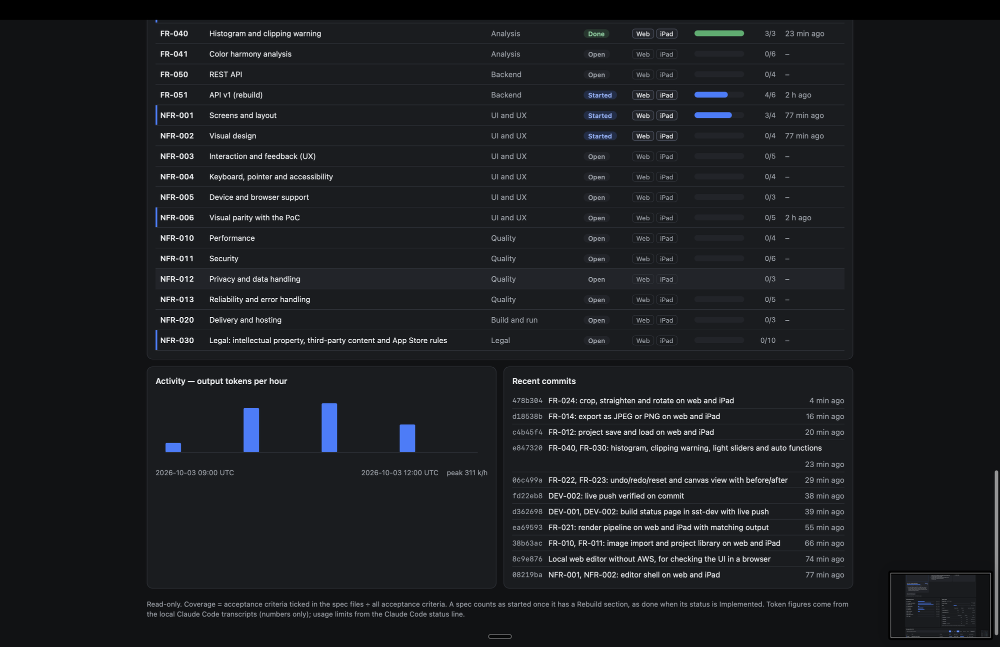

# editr-status

Read-only build status page for the editr rebuild. It lists every spec with its
acceptance-criteria coverage, overall progress, what is being worked on, and
token usage and model, and follows the work live.

This is a development tool, not part of the product.

## How it works

- **StatusSite** — Remix on Lambda behind CloudFront (SST v3, AWS `eu-central-1`).
  It only reads; it accepts no input and writes nowhere.
- **StatusData** — private S3 bucket holding one document, `data.json`.
- `npm run push` collects the status from the local repository (specs, commits,
  uncommitted files) and the Claude Code transcripts and uploads it as
  `data.json`. The open page polls for new data every 5 seconds.

The collector expects to sit in the `sst-dev/` folder of the editr repository
and reads the product specs from `../specs`.

The page shows:

- overall and per-group progress, every spec with its acceptance criteria as
  checked or unchecked boxes, jumps to FRs, NFRs and groups, `#FR-021` links;
- live, at the top: which spec and which numbered requirement (§) the agent
  is working on, with the requirement text, the current action, the last
  ticked criterion and a spinner while it works; a feed of its last 30 actions
  with spec and § links;
- uncommitted work: changed files linked to specs, the open criteria of those
  specs as the tasks left;
- token usage per model and session, and how much of the Claude plan's usage
  limits (5-hour window, week) is used, in percent;
- tables that sort by any column, ascending or descending, stable.

## Screenshots

Overall progress, key figures and what is being worked on, with the open
acceptance criteria of each linked spec as tasks:



Coverage by group, usage limits in percent, token usage per model and session:



All specs, sortable by every column, filterable by kind, state and group:



The NFRs, output tokens per hour and recent commits:



## Usage limits

The limits come from the Claude Code status line. Add it to
`.claude/settings.local.json` of the editr repository:

```json
"statusLine": { "type": "command", "command": "node \"$CLAUDE_PROJECT_DIR/sst-dev/scripts/statusline.mjs\"" }
```

It prints the model and the used percentages, and keeps the latest figures
in `.sst/limits.json` for the next push. They need a Claude subscription.

## Commands

Node >= 22, npm.

```sh
npm install
npm run dev         # Remix on http://localhost:5299
npm run typecheck   # tsc --noEmit
npm run build       # remix vite:build
npm run deploy      # sst deploy --stage dev
npm run collect     # collect the status locally
npm run push        # collect and upload data.json to the deployed bucket
```

## Deploy

With AWS credentials for the target account in the environment (for example
`AWS_PROFILE`):

```sh
npm install
npx sst deploy --stage dev    # same as: npm run deploy
```

The deploy prints two outputs: `url`, the CloudFront address of the status
page, and `bucket`, the name of the data bucket. Then fill the page:

```sh
npm run push
```

Deploy once before the first push: the bucket name comes from the deploy
outputs in `.sst/outputs.json`.

## Specs

The tool's own specs are in `specs/development-tools/`:

- [DEV-001](specs/development-tools/DEV-001-build-status-page.md) — Build status page
- [DEV-002](specs/development-tools/DEV-002-live-status-push.md) — Live status push
